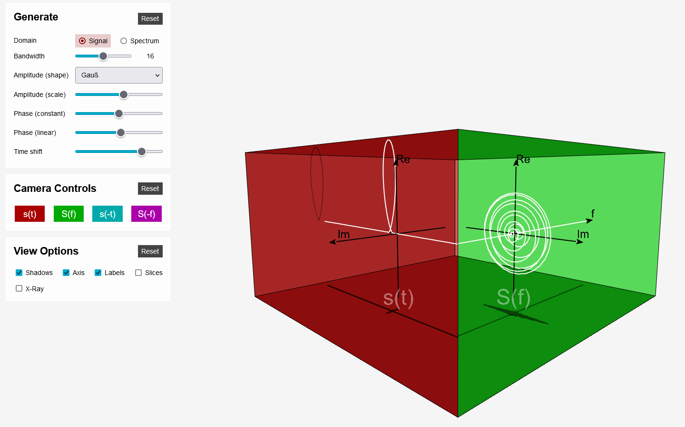

# Fourier Cuboid

Explore the interrelation between the time domain of a signal and it's spectrum.

The cuboid demonstrates the relationships between time and frequency domains. A 90 degree rotation of the cube represents a Fourier Transform. Taking the Fourier Transform twice results in the original signal flipped along the time axis. This corresponds to a 180 degree rotation i.e. viewing the signal from the backside. A third Fourier transform then results in the same spectrum as the first Fourier transform but flipped along the frequency axis. The fourth Fourier transform returns to the original signal.

By viewing two neighboring sides of the cuboid at once you can introspect the relationship between the transformation of the signal in the time domain and it's spectrum in the frequency domain. For example shifting the signal along the time axis results in a linear phase rotation of the spectrum. A constant phase shift in one domain causes the same shift in the other domain. Stretching the signals causes the spectrum to contract and vice versa.

You can chose to either model the signal and observe the resulting spectrum or to model the spectrum and observe the resulting signal.

The transformation between time and frequency domain is done via Discrete Fourier Transform (DFT). This means that the signal and spectrum are both sampled discretely and not continuous as that would not be possible on a computer. Currently 2048 samples are used. Signals with frequencies higher than 1024/period may result in aliasing.